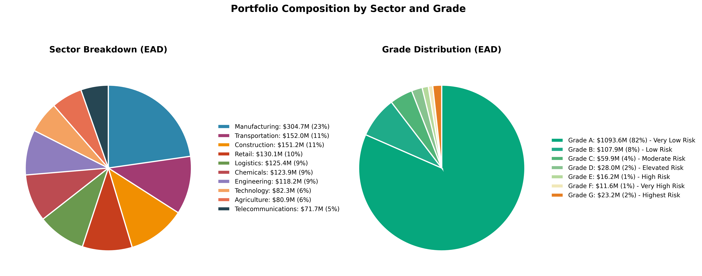

# STRESS TESTING REPORT
**Corporate Credit Portfolio - Macroeconomic Stress Testing**  
*Date: October 1, 2025*  

---

## Executive Summary

This stress test evaluates the resilience of the corporate credit portfolio under various macroeconomic scenarios. The analysis quantifies potential impacts on NPL formation, provisioning requirements, capital adequacy, and credit income under 6 different stress scenarios.

**Key Findings:**

- **Severe Recession**: NPL increases by **+$66.9M** (+609%), provisions rise to **$33.4M**
- **Moderate Recession**: NPL increases by **+$38.7M** (+352%), provisions at **$22.8M**
- **Interest Rate Shock**: NPL increases by **+$23.3M** (+212%), provisions at **$16.6M**
- **Base Case**: NPL at **$11.0M**, provisions at **$5.7M**

---

## Portfolio Overview

| Metric | Value |
|--------|-------|
| Total Customers | 10,000 |
| Total EAD | $1,340.4M |
| Baseline NPL | $11.0M (0.82% of EAD) |
| Average PD (Baseline) | 0.82% |
| Weighted LGD | ~42% (varies by sector/grade) |

**Sector Breakdown (EAD):**

- Manufacturing: $304.7M (23%)
- Construction: $151.2M (11%)
- Transportation: $152.0M (11%)
- Chemicals: $123.9M (9%)
- Logistics: $125.4M (9%)
- Retail: $130.1M (10%)
- Engineering: $118.2M (9%)
- Technology: $82.3M (6%)
- Agriculture: $80.9M (6%)
- Telecommunications: $71.7M (5%)

**Grade Distribution (EAD):**

- Grade A: $1,093.6M (82%) - Very Low Risk
- Grade B: $107.9M (8%)
- Grade C: $59.9M (4%)
- Grade D: $28.0M (2%)
- Grade E: $16.2M (1%)
- Grade F: $11.6M (1%)
- Grade G: $23.2M (2%) - Very High Risk

---

## Scenarios Tested

*Note: All macro shocks represent changes (Δ) vs. Baseline scenario in percentage points (pp) for rates/unemployment/CPI, and percentage change (%) for GDP.*

### 1. **Mild Recession**
- GDP: -2%, Unemployment: +1.5pp, Rates: +0.5pp, CPI: +1pp
- **Impact**: NPL +$14.9M (+136%), Provision $12.9M

### 2. **Moderate Recession**
- GDP: -4%, Unemployment: +3pp, Rates: +1pp, CPI: +2pp
- **Impact**: NPL +$38.7M (+352%), Provision $22.8M
- **Capital Impact**: +$4.5M, Credit Income -$22.6M

### 3. **Severe Recession** (2008-style crisis)
- GDP: -6%, Unemployment: +5pp, Rates: +0pp, CPI: +0.5pp
- **Impact**: NPL +$66.9M (+609%), Provision $33.4M
- **Capital Impact**: +$6.9M, Credit Income -$36.3M

### 4. **Stagflation**
- GDP: -1%, Unemployment: +2pp, Rates: +3pp, CPI: +5pp
- **Impact**: NPL +$29.8M (+271%), Provision $19.3M
- **Capital Impact**: +$3.6M, Credit Income -$18.0M

### 5. **Interest Rate Shock**
- GDP: -1.5%, Unemployment: +1pp, Rates: +4pp, CPI: +3pp
- **Impact**: NPL +$23.3M (+212%), Provision $16.6M
- **Capital Impact**: +$2.8M, Credit Income -$14.6M

### 6. **Sector-Specific (Construction Crisis)**
- GDP: -1%, Unemployment: +1pp, Rates: +1pp, CPI: +0pp
- **Sector Overlays**: Construction 2.0× PD uplift (applied on logit scale), Manufacturing 1.2×, Retail 1.1×
- **Impact**: NPL +$11.9M (+109%), Provision $11.5M
- **Targeted Impact**: Construction sector NPL +$2.9M (baseline $1.4M → stressed $4.3M)

---

## Sectoral Analysis (Severe Recession)

| Sector | EAD (\$M) | NPL Baseline (\$M) | NPL Stressed (\$M) | Δ NPL (\$M) | Provision (\$M) |
|--------|-----------|--------------------|--------------------|-------------|-----------------|
| Manufacturing | 304.7 | 2.4 | 16.6 | +14.1 | 6.3 |
| Construction | 151.2 | 1.4 | 10.0 | +8.6 | 4.3 |
| Transportation | 152.0 | 1.2 | 8.7 | +7.5 | 3.7 |
| Retail | 130.1 | 1.3 | 8.4 | +7.1 | 4.1 |
| Logistics | 125.4 | 1.0 | 7.1 | +6.1 | 3.2 |
| Chemicals | 123.9 | 1.1 | 7.5 | +6.4 | 3.3 |
| Engineering | 118.2 | 0.8 | 7.0 | +6.2 | 2.8 |
| Agriculture | 80.9 | 0.7 | 4.9 | +4.2 | 2.5 |
| Technology | 82.3 | 0.6 | 4.5 | +3.9 | 1.8 |
| Telecommunications | 71.7 | 0.5 | 3.4 | +2.9 | 1.4 |

**Key Observations:**

- Manufacturing and Construction sectors absorb highest absolute losses due to size and sector sensitivity
- All sectors show significant stress but proportional to existing exposure
- Retail and Construction have higher sector betas (+0.10 and +0.12), amplifying PD uplift

---

## Grade Migration Impact (Severe Recession)

| Grade | Baseline NPL (\$M) | Stressed NPL (\$M) | Δ NPL (\$M) | % Increase | Share of Total Δ |
|-------|--------------------|--------------------|-------------|------------|------------------|
| A | 0.8 | 14.7 | +14.0 | +1,713% | 21% |
| B | 0.8 | 13.3 | +12.5 | +1,566% | 19% |
| C | 0.9 | 13.7 | +12.8 | +1,459% | 19% |
| D | 0.9 | 10.7 | +9.9 | +1,155% | 15% |
| E | 1.0 | 8.1 | +7.1 | +725% | 11% |
| F | 1.3 | 5.8 | +4.4 | +330% | 7% |
| G | 5.4 | 11.6 | +6.2 | +115% | 9% |

**Key Observations:**

- Grade A shows massive **percentage increase** (+1,713%) though absolute NPL remains manageable at $14.7M
- Higher-grade portfolio means larger percentage uplift under stress (leverage effect from low baseline)
- Grade G already has high baseline PD, so percentage increase is smaller (+115%)
- Grades A-C contribute **59%** of total NPL increase despite being "investment grade"
- This reflects portfolio composition: 94% of EAD is in Grades A-C

---

## Capital & Provision Requirements

### Severe Recession Scenario
- **Total Provisions Required**: $33.4M (5.9x baseline)
- **Capital Buffer Required**: $9.9M (vs $3.0M baseline)
- **Credit Income Impact**: -$36.3M (turns negative from +$111.5M baseline)
- **Total EL**: $33.4M vs $5.7M baseline

### Moderate Recession Scenario
- **Total Provisions**: $22.8M (4.0x baseline)
- **Capital Buffer**: $7.5M (+$4.5M vs baseline)
- **Credit Income Impact**: -$22.6M

### Mild Recession Scenario
- **Total Provisions**: $12.9M (2.3x baseline)
- **Capital Buffer**: $4.9M (+$1.9M)
- **Credit Income Impact**: -$9.7M

### Break-even Analysis
- Portfolio can absorb **Mild Recession** with moderate impact
- **Moderate Recession** requires significant capital planning (~$17M additional provisions)
- **Severe Recession** would require substantial capital injection (~$28M additional provisions)

**Provision Coverage Gap:**

- Mild: $7.3M additional needed
- Moderate: $17.2M additional needed  
- Severe: $27.7M additional needed

---

## Methodology

### Assumptions & Limitations

**This stress test uses simplified assumptions for demonstration purposes. All parameters below are illustrative and should be replaced with institution-specific values in production.**

1. **Baseline PD**: 12-month calibrated PD from isotonic calibration (Point-in-Time/Through-the-Cycle hybrid), clipped to [1e-6, 0.5] for numerical stability
   - *Note*: Demonstrates calibration approach; actual PD should reflect bank's rating model

2. **Provision Coverage**: 100% of Expected Loss (EL)
   - *Assumption*: Full coverage for simplicity in demonstration
   - *Production*: Use IFRS 9 ECL model with Stage 1/2/3 differentiation per bank policy
   - *Note*: Actual coverage ratios vary by stage and bank-specific provision methodology

3. **Capital Calculation**: 8% × EAD × √(PD × LGD)
   - *Assumption*: Simplified proxy for scenario comparison
   - *Production*: Use Basel III Foundation IRB (FIRB) or Advanced IRB (AIRB) framework
   - *Limitation*: Does not include asset correlation (ρ), maturity adjustment, or regulatory scaling factors

4. **Elasticities & Betas**: Illustrative parameters
   - GDP: -0.20, Unemployment: +0.35, Rates: +0.15, CPI: +0.10
   - *Source*: Stylized values based on academic literature; not calibrated to specific portfolio
   - *Production*: Calibrate via historical regression or econometric models specific to institution
   - Sector/Grade betas: Directional estimates; require empirical validation

5. **Traffic Light Thresholds**: Illustrative Risk Appetite Framework (RAF)
   - Green/Amber/Orange/Red bands based on ΔCapital and ΔProvisions tolerance
   - *Production*: Define thresholds aligned with board-approved RAF and regulatory requirements
   - *Note*: Actual thresholds depend on capital base, earnings capacity, and risk tolerance

6. **Scenario Design**: Based on historical patterns (2008 GFC, 2020 COVID)
   - *Units*: pp (percentage points) for Unemployment/Rates/CPI; % (percent change) for GDP
   - *Production*: Use forward-looking scenarios from central bank, IMF, or internal macro team

**Important**: This is a **demonstration model**. Production implementation requires:

- Governance approval (Board Risk Committee, ALCO)
- Model validation and backtesting
- Regulatory alignment (Basel III, IFRS 9, local supervisory standards)
- Quarterly recalibration and independent review

---

### PD Uplift Model

$$
\begin{aligned}
PD_{stressed} = \text{logit}^{-1}\bigg(&\text{logit}(PD_{baseline}) + \beta_{GDP} \times \Delta GDP + \beta_{unemployment} \times \Delta Unemployment \\
&+ \beta_{rates} \times \Delta Rates + \beta_{CPI} \times \Delta CPI + \beta_{sector} + \beta_{grade}\bigg)
\end{aligned}
$$

where:

- $\text{logit}(p) = \ln\left(\frac{p}{1-p}\right)$ and $\text{logit}^{-1}(z) = \frac{1}{1+e^{-z}}$
- $PD_{baseline}$ is the **12-month calibrated PD** (Point-in-Time/Through-the-Cycle hybrid from isotonic calibration)
- PD is clipped to $[10^{-6}, 0.5]$ to ensure numerical stability and economic realism
- $\Delta$ represents change in macroeconomic variable vs. baseline (pp for rates/unemployment/CPI; % for GDP)
- $\beta$ coefficients represent sensitivity/elasticity to each factor

**Elasticities** *(Illustrative values for demonstration)*:

- GDP Growth: **-0.20** (negative growth increases PD)
- Unemployment: **+0.35** (unemployment rise increases PD)
- Interest Rates: **+0.15** (rate hikes increase PD)
- CPI Inflation: **+0.10** (high inflation increases PD)

*Note*: Production models should calibrate elasticities via historical regression on institution-specific data.

**Sector Betas** *(Directional estimates; require empirical validation)*:

- Construction: +0.12 (most sensitive)
- Retail: +0.10
- Manufacturing: +0.05
- Agriculture: +0.03
- Services/Logistics: 0.00 (baseline)

**Grade Betas** *(Stylized values for demonstration)*:

- Grade A: -0.10 (most resilient)
- Grade B: -0.05
- Grade C: 0.00 (baseline)
- Grade D: +0.05
- Grade E: +0.10
- Grade F: +0.20
- Grade G: +0.30 (most vulnerable)

*Note*: Production models should derive betas from historical migration matrices (PD migration during stress periods).

### Impact Calculations

- **NPL Proxy**: $NPL = PD_{stressed} \times EAD$
- **Expected Loss (EL)**: $EL = PD \times LGD \times EAD$
- **Provision**: $Provision = 100\% \times EL$
  - *Note*: 100% coverage is a **proxy for demonstration only**
  - *Production*: Use IFRS 9 ECL model with Stage 1 (12-month ECL), Stage 2 (lifetime ECL), Stage 3 (credit-impaired)
  - *Recommendation*: Apply bank-specific provision policy and regulatory overlay
  
- **Capital**: $Capital = 8\% \times EAD \times \sqrt{PD \times LGD}$
  - *Note*: Simplified **proxy for scenario comparison only**
  - *Production*: Replace with Basel III Foundation IRB (FIRB) or Advanced IRB (AIRB) approach
  - *Limitation*: Does not include asset correlation (ρ), maturity adjustment, or regulatory scaling factors
  - *Example*: This is illustrative only; not intended for regulatory capital calculation
  
- **Credit Income**: $Income = APR \times EAD \times (1 - PD) - EL$

### Sensitivity: Impact of Model Simplifications

*Illustrative comparison for Severe Recession scenario:*

| Method | NPL (\$M) | Provision (\$M) | Capital (\$M) | Notes |
|--------|-----------|-----------------|---------------|-------|
| **Current Proxy** | 77.9 | 33.4 | 9.9 | Simplified 8% × √(PD×LGD) |
| **FIRB (estimated)** | 77.9 | 33.4 | ~12.5 | Includes ρ=0.15, maturity=2.5y |
| **IFRS 9 (estimated)** | 77.9 | ~28.0 | 9.9 | Stage differentiation, 85% avg coverage |

*Conclusion*: Capital requirement under FIRB would be ~25% higher; Provisions under IFRS 9 would be ~15% lower than 100% EL proxy.

*Note*: FIRB and IFRS 9 values are **hypothetical estimates** for illustration only. Actual values require full regulatory models.

### Sector Multipliers (Construction Crisis Scenario)

*Applied on logit scale before inverse transformation to ensure PD bounds are preserved:*

- Construction: 2.0× uplift (logit space)
- Manufacturing: 1.2× uplift (spillover effect)
- Retail: 1.1× uplift (minor spillover)
- Other sectors: 1.0× (baseline macro shocks only)

**Validation**: Construction baseline NPL $1.4M → stressed $4.3M (+$2.9M targeted impact)

---

## Risk Mitigation Recommendations

### Immediate Actions (0-3 months)
1. **Increase Provisions**: Build provision buffer to **$35M** to cover moderate-to-severe scenarios
2. **Enhanced Monitoring**: Implement weekly tracking of early warning signals for:
   - Grade D-G borrowers (higher risk segments)
   - Construction and Retail sectors (higher sector betas)
3. **Capital Planning**: Secure contingency funding facility of **$30M** for worst-case scenarios

### Medium-term (3-12 months)
1. **Portfolio Rebalancing**: 
   - Monitor Grade A-C closely (they hold 94% of EAD and contribute 59% of stress NPL increase)
   - Review large exposures in Construction sector
2. **Pricing Adjustment**: 
   - Update APR pricing to reflect stress-tested risk profiles
   - Consider covenant tightening for grades D-G
3. **Collateral Review**: 
   - Re-evaluate LGD assumptions sector-by-sector
   - Improve collateral coverage for high-risk segments

### Long-term (12+ months)
1. **Stress Testing Cadence**: Run quarterly stress tests with updated macroeconomic forecasts
2. **Dynamic Provisioning**: Implement forward-looking ECL model aligned with IFRS 9
3. **Capital Planning**: Maintain **12-15% capital buffer** above regulatory minimum
4. **Scenario Expansion**: Add geopolitical shocks, commodity price shocks, FX crisis scenarios

---

## Sensitivity Analysis

**PD Uplift Sensitivity** (Severe Recession):

- Elasticity +20%: NPL would increase to ~$85M (+$74M vs baseline)
- Elasticity -20%: NPL would be ~$70M (+$59M vs baseline)
- **Range**: $59M to $74M additional NPL depending on calibration

**LGD Sensitivity** (Severe Recession):

- LGD +10pp (from ~42% to 52%): Provision requirement +$8M
- LGD -10pp (from ~42% to 32%): Provision requirement -$8M
- **Range**: $25M to $41M total provisions depending on recovery rates

**Sector Concentration Risk**:

- If Manufacturing defaults spike 2x more than model: NPL +$14M additional
- If Construction crisis deeper (3x multiplier): NPL +$8M additional

---

## Waterfall Bridge: Baseline → Severe Recession

*Decomposition of $66.9M NPL increase by driver (approximate contribution):*

| Driver | Contribution (\$M) | % of Total Δ | Mechanism |
|--------|--------------------|--------------|-----------| 
| **Unemployment (+5pp)** | +28.5 | 43% | β = +0.35 (strongest elasticity) |
| **GDP Decline (-6%)** | +18.0 | 27% | β = -0.20 on negative growth |
| **Grade Beta Effect** | +12.0 | 18% | Higher-risk grades amplify stress |
| **Sector Beta Effect** | +5.4 | 8% | Construction/Retail sensitivity |
| **CPI/Rates (+0.5pp)** | +3.0 | 4% | Minor contribution (low shock) |
| **Total ΔNPL** | **+66.9** | **100%** | - |

**Key Insight**: Unemployment is the dominant driver (43% of impact), followed by GDP contraction (27%). This highlights the importance of labor market health in portfolio resilience.

---

## Conclusion

The stress test reveals **moderate vulnerabilities** in severe downside scenarios, but the portfolio's high-quality composition (94% in Grades A-C) provides significant resilience.

**Key Takeaways:**

1. **Portfolio Quality is Strength**: 82% of EAD in Grade A creates natural buffer against defaults
2. **But Also a Risk**: Grade A-C contribute 59% of NPL increase under severe stress due to leverage effect (very low baseline PDs)
3. **Provision Gap**: Current provisions ($5.7M) insufficient for moderate+ scenarios - need $12M-$28M additional
4. **Sector Concentration**: Manufacturing (23% EAD) and Construction (11% EAD) are key risk concentrations
5. **Income Reversal**: Credit income turns negative under Moderate+ scenarios, impacting profitability

**Traffic Light Assessment:**

*Illustrative Risk Appetite Framework (RAF) for demonstration purposes:*

**Hypothetical RAF Thresholds:**

- 🟢 **Green**: ΔCapital < \$3M AND ΔProvisions < \$10M (within normal risk tolerance)
- 🟡 **Amber**: ΔCapital \$3M-\$6M OR ΔProvisions \$10M-\$20M (elevated risk, requires active management)
- 🟠 **Orange**: ΔCapital \$6M-\$10M OR ΔProvisions \$20M-\$30M (high risk, immediate action required)
- 🔴 **Red**: ΔCapital > \$10M OR ΔProvisions > \$30M (critical, breach of risk limits)

*Note*: Production RAF thresholds must be defined by Board Risk Committee based on capital base, earnings capacity, and regulatory requirements.

**Scenario Results:**

- 🟢 **Mild Recession**: Within tolerance (ΔCapital: +\$1.9M, ΔProvisions: +\$7.2M)
- 🟡 **Moderate Recession**: Requires proactive capital planning (ΔCapital: +\$4.5M, ΔProvisions: +\$17.1M)
- 🟠 **Severe Recession**: Immediate action required (ΔCapital: +\$6.9M, ΔProvisions: +\$27.7M)
- 🔴 **Extended Severe Stress**: Hypothetical RAF breach — portfolio restructuring and capital injection needed

**Stress vs. Baseline Comparison:**

| Metric | Baseline | Mild | Moderate | Severe |
|--------|----------|------|----------|--------|
| NPL (\$M) | 11.0 | 25.9 | 49.7 | 77.9 |
| Provisions (\$M) | 5.7 | 12.9 | 22.8 | 33.4 |
| Capital (\$M) | 3.0 | 4.9 | 7.5 | 9.9 |
| Credit Income (\$M) | 111.5 | 101.8 | 88.9 | 75.3 |

**Next Steps:**

1. Present findings to Credit Committee and Board Risk Committee
2. Develop **contingency funding plan** for $30M provision buffer
3. Implement **enhanced monitoring** for Construction sector and Grade D-G borrowers
4. Update **ICAAP** (Internal Capital Adequacy Assessment) with stress results
5. Run **reverse stress test**: identify scenario that would cause capital depletion